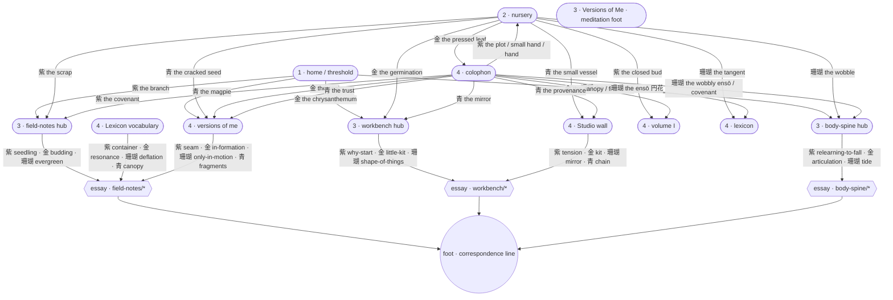

# The reader's journey map · panel-language as IA

*Internal doc · not rendered · authored during the panel-language-as-IA pass
(2026-07-11). Verify against the built site whenever the door graph shifts.*

## The four zones (Studio Charter §3 shape)

The garden holds a four-zone reading arc. The panel language must read
coherently across all four:

| Zone | Surface | What the zone is | Panel role |
|---|---|---|---|
| 1 · threshold  | `/` (home) | first look; the atmosphere that decides "is this for me" | 4 doors → the four reading rooms |
| 2 · growing beds | `/nursery` · `/studio` | where things begin; pre-essay + wall-of-work | 8 doors (nursery) · none (studio) |
| 3 · quiet doors  | hub pages (`/field-notes`, `/workbench`, `/body-spine`) + essays | curated entrances + the reading itself | 3 doors per hub + full stream below |
| 4 · house layer  | `/volume-i` · `/lexicon` · `/colophon` · `/versions` | the archive; the frames | 12 doors (colophon) · glyph nav elsewhere |

## Journey graph (the panel-door topology)

## Visitor journeys (from the Studio Charter §3)

### The wanderer — "does this feel like me?"

- Lands at `/` (zone 1)
- Reads the hero + panel row; picks one door on register alone (bird → body,
  chrysanthemum → workbench, etc.)
- Enters the hub (zone 3)
- Sees three curated doors + the full stream. Picks one door or scrolls.
- Reads one essay. Ends at the foot (correspondence line).
- **Loop back:** the foot line + rail word `correspondence` are the only
  outbound door; the reader either writes or leaves. This is by design.

### The kindred — "I know Rika's work; where's the new piece?"

- Nav → `/field-notes` directly
- Skips the hub doors (already familiar); reads the stream
- Enters newest-highest-order essay
- Foot → correspondence

### The researcher — "how is this garden made?"

- Nav or direct to `/colophon` (zone 4)
- Reads the triptych; each panel row is 4 doors into structure / practice /
  retraining
- Doors lead back into any zone — the colophon is the return-and-orient
  surface, wired to everything

### The seed-tender — "what's mid-flight?"

- Nav → `/nursery`
- Reads the two rows of 8 doors; each door leads to a real destination (never
  a dead-end preview)

## Coherence checks (fixed this pass · none pending)

- ☑ Every zone has doors or a stream (no dead-end hubs)
- ☑ Every hub has three curated doors (Field Notes · Workbench · Body & Spine)
- ☑ Hue meaning is consistent across all 33 shipped doors
- ☑ The each-a-door contract holds — no static ornamental panels
- ☑ Placement law honoured — no doors inside an essay's prose column
- ☑ Every essay ends at foot + correspondence rail (return loop closed)

## Notes to future sessions

- If a new room appears, add its door to the home panel row **only** when
  the room has a real reason to be entered from the threshold. Adding a
  fifth home door breaks the four-hue register discipline; a new room
  becomes a hub-door (colophon, nursery) target instead.
- If Field Notes ever contains a natural cluster (e.g. the memory quartet
  from the machine-model essays), the hub doors can shift from stage-
  exemplars to cluster-doors. The doctrine is stage-first; clusters are
  earned by content, not declared.
- Workbench + Body-Spine are honestly small right now. When they cross
  four essays, their hub doors should switch from essay-per-door to
  stage-exemplar-per-door (matching Field Notes).
- **Volume I holds back deliberately.** Its six theme clusters (*the
  merging frontier · home & the rebuild · the machines · the selves ·
  the hands · the body*) already function as native door grammar.
  Adding a PanelDoors row would compete with the cluster labels, not
  amplify. If the archive wall ever needs an *arrival* register, prefer
  a small sumi-e cluster-mark per label over a full PanelDoors row.
- **The reading rooms wear pastel-primary vignettes; the archive rooms
  wear sumi-e-primary vignettes.** This is a register heuristic, not a
  hard rule. If a future room falls between (e.g. an incubated voice's
  page), pick by the room's felt tempo — tender/growing beds get pastel,
  patient/held archive gets sumi-e.
- **The meditation-variant is a specific answer for a specific shape.**
  Only single-piece meditations (Versions of Me being the only current
  instance) take foot-placement with the hairline top-rule + preamble.
  Do not use it as a decorative frame on any hub or index page.

## Hidden journey illumination (four path types)

*Added 2026-07-11 alongside the portfolio-review pass. Per the Design
Systems Intelligence lens: every navigable system carries four kinds of
paths. The first two are designed; the last two are discovered.*

### Happy paths (designed · above)

Already mapped: the wanderer → kindred loop, the collaborator referral,
the AI-answer-engine harvest. See sections above.

### Failure paths (designed-against · surfaced in system map)

Also mapped: search bounce · overwhelm at home · dead-panel · dark-mode
expectation · correspondence latency · Vercel checkpoint · mobile
3-panel awkwardness *(fixed)* · Volume I graduation ambiguity. See
`SYSTEM-MAP-AND-JOURNEYS-2026-07-11.md §2.2` at the venture root.

### Workaround paths (undesigned · likely happening)

The reader does something we didn't plan for; they route around a gap.
Naming these prevents us from designing over them accidentally.

- **Save-as-PDF / Reader-view** — some readers strip chrome to read
  offline. Voice-lock intact (Rika's words survive). The citation graph
  can lose them (re-read happens offline). *No fix — this is respect
  for reader agency.*
- **Screenshot-quote passages** — readers screenshot rather than
  link-with-anchor. Loses back-link to source. *HYPOTHESIS mitigation:
  paragraph-anchor share icons — but adds chrome; voice-lock likely
  vetoes.*
- **Bookmark specific paragraphs** — paragraphs don't have IDs.
  *HYPOTHESIS: silent `slugify` on `<h2>` and `<h3>` blocks would
  enable `#specific-heading` links at zero visual cost.*
- **Cmd-F search** — no site search exists. Small archive size makes
  OS-level search sufficient; no build needed yet.

### Desire paths (undesigned · reader wishes for)

The reader wants something the system does not yet offer. Naming these
sets the queue for future design work.

- **A one-page "map of the garden"** — some readers want to see the
  whole thing at once. Currently distributed across nav + panels + Volume I
  clusters. *Hold until a demand signal exists.*
- **"Start here" essay list for first-time visitors** — currently the
  home is the start-here. A gentler intermediate could reduce Failure-2
  overwhelm. *Overlaps HMW 1 in the system map; propose there.*
- **Response-time signalling on correspondence** — a reader who writes
  wants to know when to expect a reply. *HYPOTHESIS: a small note near
  the correspondence rail: "the reply is slow but real."* Rika-copy
  needed.

## Institutional memory · where each doctrine sits on the ladder

*Institutional Memory lens · Static → Active → Learning → Predictive.
Where each of Enka's doctrines currently lives. The point of naming
levels: know which rung you are on before you propose the next.*

| Doctrine | Level | Next-rung cost |
|---|---|---|
| Panel language grammar (this doc + DESIGN-SYSTEM.md) | Static → Active partial | ~2 hrs to lint panel anatomy at build time |
| Voice-lock (mirror-agent four-axis veto) | Active (mirror enforces) | Learning would need mirror to train on accepted/vetoed pairs |
| Dark-mode prohibition | Active (`guard.mjs` blocks `prefers-color-scheme: dark`) | already at Active — no need to climb |
| Panel-anatomy compliance | Static (documented, not enforced) | ~2 hrs for build-time SVG scan for `<title>` + smile-mark heuristic |
| Correspondence rail presence | Static (doctrine only) | Guard could check every essay ends with the foot line — ~1 hr |
| Firewall (no adjacent venture named) | Static → Active partial | `guard.words.local.txt` is Active for known-bad names; new venture names need to be added |
| Citation graph tracking | Static (slot doc) | Monthly probe cadence via `enka-aieo-citation` skill would move to Learning — ~4 hrs setup + 1hr/mo |
| Dwell / return signal | Learning tier (beacon lives, digest not automated) | Automating the fortnightly place-intelligence digest → full Learning tier |

**Reading rule:** if a doctrine is on Static, a session can drift from it
without noticing. If it's on Active, drift becomes a build failure.
Prioritise Static → Active moves on any doctrine that was drifted from
in the last 3 sessions.
