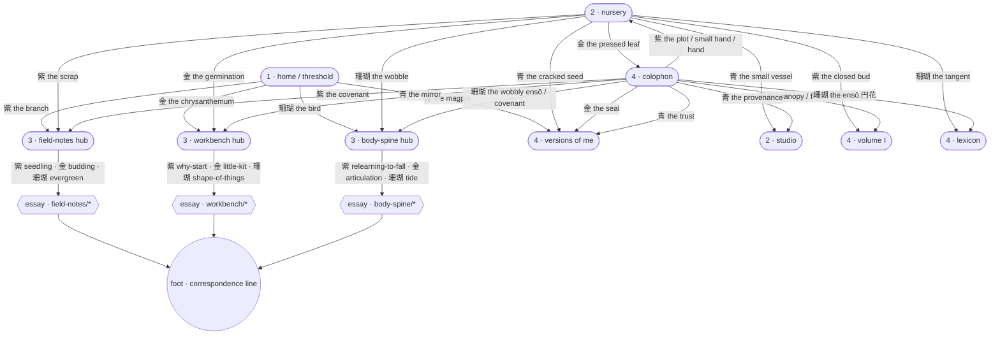

# The reader's journey map · panel-language as IA

*Internal doc · not rendered · authored during the panel-language-as-IA pass
(2026-07-11). Verify against the built site whenever the door graph shifts.*

## The four zones (Studio Charter §3 shape)

The garden holds a four-zone reading arc. The panel language must read
coherently across all four:

| Zone | Surface | What the zone is | Panel role |
|---|---|---|---|
| 1 · threshold  | `/` (home) | first look; the atmosphere that decides "is this for me" | 4 doors → the four reading rooms |
| 2 · growing beds | `/nursery` · `/studio` | where things begin; pre-essay + wall-of-work | 8 doors (nursery) · none (studio) |
| 3 · quiet doors  | hub pages (`/field-notes`, `/workbench`, `/body-spine`) + essays | curated entrances + the reading itself | 3 doors per hub + full stream below |
| 4 · house layer  | `/volume-i` · `/lexicon` · `/colophon` · `/versions` | the archive; the frames | 12 doors (colophon) · glyph nav elsewhere |

## Journey graph (the panel-door topology)

## Visitor journeys (from the Studio Charter §3)

### The wanderer — "does this feel like me?"

- Lands at `/` (zone 1)
- Reads the hero + panel row; picks one door on register alone (bird → body,
  chrysanthemum → workbench, etc.)
- Enters the hub (zone 3)
- Sees three curated doors + the full stream. Picks one door or scrolls.
- Reads one essay. Ends at the foot (correspondence line).
- **Loop back:** the foot line + rail word `correspondence` are the only
  outbound door; the reader either writes or leaves. This is by design.

### The kindred — "I know Rika's work; where's the new piece?"

- Nav → `/field-notes` directly
- Skips the hub doors (already familiar); reads the stream
- Enters newest-highest-order essay
- Foot → correspondence

### The researcher — "how is this garden made?"

- Nav or direct to `/colophon` (zone 4)
- Reads the triptych; each panel row is 4 doors into structure / practice /
  retraining
- Doors lead back into any zone — the colophon is the return-and-orient
  surface, wired to everything

### The seed-tender — "what's mid-flight?"

- Nav → `/nursery`
- Reads the two rows of 8 doors; each door leads to a real destination (never
  a dead-end preview)

## Coherence checks (fixed this pass · none pending)

- ☑ Every zone has doors or a stream (no dead-end hubs)
- ☑ Every hub has three curated doors (Field Notes · Workbench · Body & Spine)
- ☑ Hue meaning is consistent across all 33 shipped doors
- ☑ The each-a-door contract holds — no static ornamental panels
- ☑ Placement law honoured — no doors inside an essay's prose column
- ☑ Every essay ends at foot + correspondence rail (return loop closed)

## Notes to future sessions

- If a new room appears, add its door to the home panel row **only** when
  the room has a real reason to be entered from the threshold. Adding a
  fifth home door breaks the four-hue register discipline; a new room
  becomes a hub-door (colophon, nursery) target instead.
- If Field Notes ever contains a natural cluster (e.g. the memory quartet
  from the machine-model essays), the hub doors can shift from stage-
  exemplars to cluster-doors. The doctrine is stage-first; clusters are
  earned by content, not declared.
- Workbench + Body-Spine are honestly small right now. When they cross
  four essays, their hub doors should switch from essay-per-door to
  stage-exemplar-per-door (matching Field Notes).
